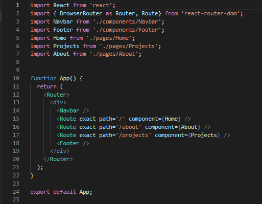
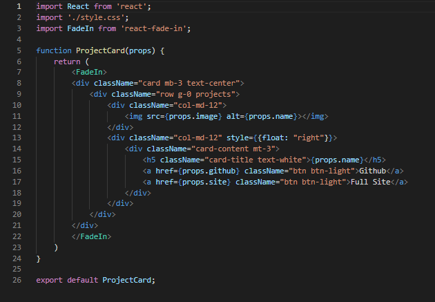

# React Portfolio

 In this assignment I created my final portfolio using React.js. I created a React app and created 3 different pages for Home, About and Projects. In order to do so I needed to use React Router to recognize the path to the page being clicked on. I created components to plug in to the pages I would like the components to be shown on. I also used a Navbar and Footer on every single page containing my contact information. If you would like to view my portfolio, please click the link below:

[Portfolio](https://dnovelli1.github.io/reactportfolio/)

## Table of Contents

* [Technology-Used](#technology-used)

* [Making](#making)

* [Questions](#questions)

* [License](#license)

## Technology-Used

- GitHub - repository storage for the project in order to amke changes, deploy them and push to a main branch. 

- GitBash - used for written commands and communicating with the repository stored on GitHub.

- HTML - used to create and edit electronic documents stored on the web.

- CSS - used to edit style and appearance of the website. (Bootstrap)

- React - 
    - Components
    - Pages
    - React Router
    - React Fade In

## Making

How was it made? Take a look here!

This is an example of the App.js. Here I am using Router to direct users to the corresponding page they would like to see based off of the referenced link in the href. The Navbar and Footer are shown on every page so I included their components here as well. 

In this example I am passing props to my project card. I have a map method creating each project card containing a photo and links to each of the projects. The map will create a card for however many projects I have inside of array of objects.

## Questions

Please click the link to see my Full GitHub profile:

[GitHub](https://github.com/dnovelli1)

If you have any questions, please see the following links to best get in contact with me:

[Email Me](jakenovelli11@gmail.com)

## License

This project is currently licensed under the [MIT-License](LICENSE)
  
